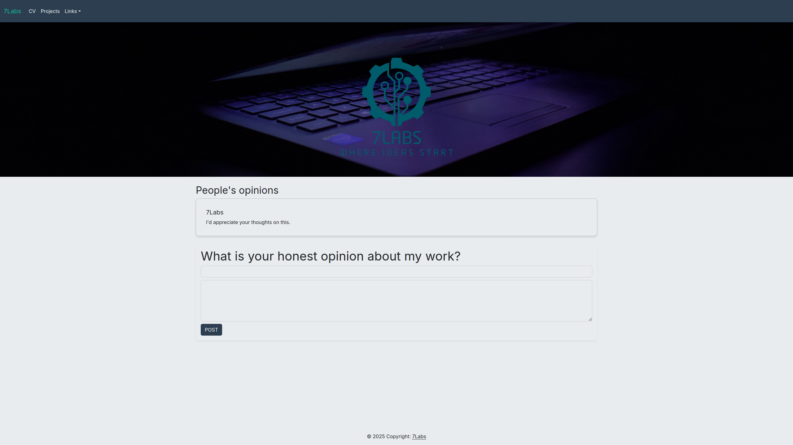

# Raspberry Pi Home Server Project

This repository documents my personal Raspberry Pi home server setup and the configurations I used to build it.  
The project focuses on learning Linux, improving IT administration skills, and building a secure and functional server environment.

---

## Features Implemented

### SSH Hardening
- Configured SSH keys for authentication ([sshd_config.md](Configs/sshd_config.md))
- Disabled root login
- Changed default SSH port
- Fail2Ban + UFW firewall rules ([Fail2Ban_jail.local.md](Configs/Fail2Ban_jail.local.md), [UFW_rules.md](Configs/UFW_rules.md))
- Remote access via Tailscale  

### System Maintenance
- Automatic security updates with email notifications ([unattended-upgrades.md](Configs/unattended-upgrades.md))
- Custom hostname
- Monitoring with `journalctl` for logs and troubleshooting

### File Management
- SFTP access
- File Browser web application ([Web_file_browser.png](Assets/Web_file_browser.png))

### Monitoring
- Netdata for real-time system metrics ([Netdata.png](Assets/Netdata.png))

### Storage & Backups
- External USB drive for persistent storage
- Automated daily backups using `rsync`

### Web Hosting
- Nginx setup for serving websites and apps ([Nginx_Laravel_Conf.md](Configs/Nginx_Laravel_Conf.md))
- **Laravel Framework Integration**
  - First page deployment
  - Custom route configuration
  - MVC architecture (Model, View, Controller)
- Cloudflare Tunnel for public access

---

## 7pi Labs – Laravel Practice Project

**Live Site:** [7pi Laboratory](http://7pi-labs.tech)  

**Description:**  
This is the first version of a personal project website built with **Laravel**.  
It was developed entirely for **learning and practice purposes**, using **Blade templates**, **Vim**, and an **SQLite database**.  

**Features Implemented:**
- Responsive layout using **Bootstrap 5 (Flatly theme)**
- Hero section, navbar, and footer
- Comment system (display & save)
- Forms and cards styled for readability
- Display the latest comments
- Add new comments through a simple form
- Fully responsive on desktop and mobile

**Tech Stack:**
- Backend: Laravel 12.25.0, PHP 8.3.6
- Database: SQLite
- Frontend: Bootstrap 5, Google Fonts (Inter)

**Notes:**
- This is an **early-stage version** built purely for learning
- All database data is for **practice only**
- Built entirely in **Vim**
- First release, improvements ongoing

---

## Project Log
  - [Project_Log](/PROJECT_LOG.md)

### Raspberry Pi Home Server
- SSH Hardening: keys, fail2ban, ufw
- System monitoring: Netdata, journalctl
- File management: SFTP, File Browser
- Web hosting: Nginx, Laravel integration
- Backups & Storage setup

### 7pi Labs
- Created first version of personal project site
- Practiced Laravel routing, Blade templates, MVC
- Implemented comments system
- Styled forms and cards using Bootstrap 5
- Practiced using Vim for coding
- Built for learning, no production data

---

## Future Plans
- Host lightweight services (wiki, dashboard)
- Expand monitoring and backups
- Improve 7pi Labs with more interactive features

---

## Configuration Files
The `Configs/` directory contains **example versions** of the configuration files used.  
All sensitive information has been **sanitized**.  

These files are for **documentation and reproducibility**, not for direct deployment.

---

## Badges

---

## License
This project is for **educational purposes only**.

